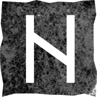

# Хагалаз

### Прямое положение

>Естественные разрушительные силы вселенной, никому не подвластная стихия, перемены, неожиданные события, подарок судьбы.

Опасность и потери, но не только и не столько для вас. Например, неожиданный крах противника, вызванный обстоятельствами непреодолимой силы.

Разрушение как очищение – расчистка места для чего-то нового. Возможно, вам пора построить новый дом и завести новую семью на фундаменте из любви и взаимного уважения.

Нет худа без добра. Ловите свою удачу, действуйте.

### Перевёрнутое положение

>Разрушение во всех формах: разрыв отношений, неудачи в делах, удар судьбы, негативные перемены; неожиданные события, мешающие осуществлению планов.

Внезапный натиск внешней силы, на которую вы не можете повлиять, рвёт в клочья ваши отношения, карьеру и уверенность в себе. Благоприятный исход возможен только если рядом Феху или Йера.

Вы не бессильны. У вас достаточно воли и силы духа, чтобы преодолеть этот этап. Вы подвергаете сомнению то, что раньше считали дарами. Это вызвано потребностью в росте. Чем сложнее сейчас, тем сильнее вы станете потом. Ваша жизнь полностью изменится.