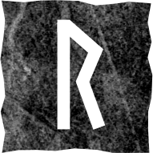

# Райдо

### Прямое положение

>Путь, путешествие, деловая поездка, развитие, совершенствование навыков, связь и воссоединение, хороший совет, благоприятное время для принятия решений.

Если вопрос о настоящем – вы уже на пути к чему-то. Если вопрос о будущем – путь вам только предстоит. В любом случае вы не стоите на месте, возможно – строите отношения или осуществляете какой-то проект. Вас ждут перемены. Это хорошее время для сделок (покупка, продажа), для получения важной информации.

Доверяйте ходу событий и самому себе. Не тратьте время на рассуждения – просто идите.

### Перевёрнутое положение

>Тупик, нерешительность, неверный путь, плохое время для путешествия, проблемы вызваны внешними переменами, новые контакты и перспективы.

Вас ждут неожиданные события, но неизвестно, какими они будут. Если на работе появятся новые возможности, придётся постараться, чтобы ими воспользоваться. С друзьями и близкими возможны ссоры и даже разрыв – будьте осторожны в общении, следите за словами.

Наберитесь терпения и сохраняйте присутствие духа. Ничего фатального, просто непрогнозируемые перемены. Процессы и результаты не будут негативными, скорее – не такими, как вы ожидали. Соберитесь, думайте, анализируйте. Не упустите удачу. Ничто хорошее не достаётся легко.