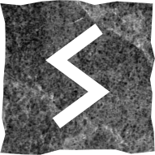

# Сол

### Прямое положение

>Солнце, власть, победа и успех, жизненная сила, хорошее здоровье, отпуск, мотивация.

В мире нет ничего невозможного. У вас достаточно сил, чтобы добиться поставленной цели. Вы видите вещи в их истинном свете. Мечтайте смелее и ваши мечты станут реальностью.

Сол – это духовная энергия, которая направляет истинного искателя. Это сила духа и оккультные способности. Руна предвещает вознесение на вершину.

### Перевёрнутое положение

>Хороший воин умеет не только драться, но и вовремя отступать, чтобы восстановить силы. Если ситуация давит на вас – отдохните. Это не поражение.

В перспективе вам всё по плечу, но сейчас нужно умерить пыл. Остановитесь, оцените свои возможности, а затем с новыми силами вернитесь в бой и тогда победа гарантирована.