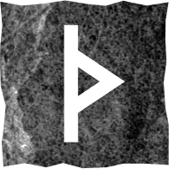

# Турисаз

### Прямое положение

>Критическая ситуация, требующая максимального напряжения. Врата, активная защита, устранение препятствий. Путешествие, переезд.

Вы вступили в полосу испытаний и всё зависит только от вас. Ситуация требует серьёзного размышления, сосредоточенности и самоограничения. Не совершайте никаких действий без тщательного предварительного анализа. 

Вы думаете, что получили удар судьбы, но это лишь укол, который призван предупредить. Остановитесь, иначе проскочите мимо дверей в счастье. Спешка – ваш главный враг. Прошлый особенно важен.

Не спешите, ждите, размышляйте. Переоцените ситуацию и вступайте во врата. Вас ждёт новый путь.

### Перевёрнутое положение

>Саморазрушение, самообман, упрямство, неискренность, растерянность, поспешные решения и их неприятные последствия, вынужденное путешествие с кем-то.

Вы боитесь взглянуть правде в глаза и действуете только под внешним давлением. Но ваши действия в любом случае не могут ничего изменить. Недостаточно обдуманные решения сделают только хуже. Переживите это, разберитесь и сделайте выводы.

Не приумножайте свою роль в происходящих событиях, не страдайте манией величия. Вы не всегда можете повлиять на ситуацию. Не спешите. Остерегайтесь неискренности и предательства.