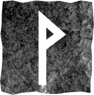

# Виньо

### Прямое положение

>Праздник и радость, победа, слава и процветание, гармония, счастье, успех, приятный сюрприз.

Чёрная полоса закончилась, начинается светлая. Должно произойти радостное событие (возможно, вы его давно ждали). Это результат ваших усилий. Вы пожинаете плоды своих трудов. Сейчас ваше «хочу» совпадает с «могу». Руна указывает на положительный исход ситуации. 

Помните: ничто не пропадает втуне. Добро, которое вы несёте в мир, всегда возвращается. Впустите радость в свою жизнь, как именно – пусть подскажет интуиция.

### Перевёрнутое положение

>Кризис, страдания, несчастье, нарушенные взаимоотношения, дисгармония, осторожность, самопожертвование (отказ от своих интересов в пользу другого человека).

Праздник жизни прошёл, и похоже, вы перебрали на нём, наступает похмелье. Друзья оказались фальшивыми. Вы не удовлетворены собой и работой, вас раздирают внутренние конфликты, мешают застарелые комплексы. В отношениях – промедление и разочарование.

Вы необъективны, поэтому остановитесь, проанализируйте ситуацию и трезво оцените её. Если у вас деловой вопрос – будьте осмотрительны, важные решения лучше отложить.

Руна может указывать на порчу, сглаз.

Не спешите с принятием решений. Не допускайте лжи и неискренности в отношениях с людьми. Не поддавайтесь сомнениям. Вам не нужна тотальная переоценка всего и вся. Отсутствие света временно, это возможность научиться видеть в темноте, а сил у вас достаточно.